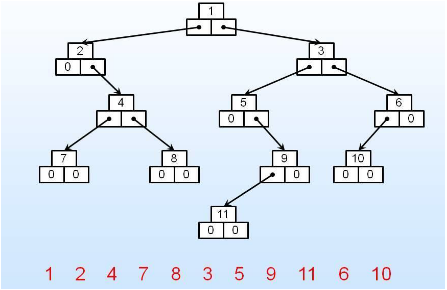

# УСЛОВИЯ ЛАБОРАТОРНЫХ РАБОТ ЗА ТРЕТИЙ СЕМЕСТР по курсу Алгоритмы и Структуры Данных

### Лаба №1 "Задача о скобках"

(Задача состоит из двух пунктов, но вы можете не париться и делать сразу второй)

На вход подаётся строка, состоящая из скобок. Программа должна определить правильность введённого скобочного выражения. Савкин сказал, что программа должна работать на русском языке: "Введите строку", "Строка не существует", "Строка существует" и т.п.

Пункт 1: В строке будут скобки только одного типа: или "()" , или "{}", или "[]"

Пункт 2: В строке будут все три вида скобок

Для успешной сдачи лабы оба пункта программа должна выполнять корректно (можно сделать отдельные программы на каждый пункт)

Пример входа:
()[({}())]

### Лаба №2 "Задача об арифметическом выражении"

На вход подаётся математическое выражение. Элементы - числа. Операции - "+ - * /". Также есть скобочки. Окончанием выражения служит "=". Программа должна вывести результат выражения

Пример ввода:

2+7*(3/9)-5=

Замечание: программа также должна делать "проверку на дурака": нет деления на 0, все скобки стоят верно (см лабу №1) и т.п.

### Лаба №3 "Задача о простых множителях"

На вход дается одно число х, нужно вывести все числа от 1 до х, удовлетворяющие условию: 

3^K  * 5^L  * 7^M =xi 
 
где K, L, M - натуральные числа или могут быть равны 0.

### Лабы №4-12 "Методы сортировки"

Дана последовательность чисел. Отсортировать и вывести последовательность чисел, определённым методом.

4. Сортировка методом прочесывания

5. Вставками

6. Посредством выбора

7. Шелла

8. Поразрядная

9. Пирамидальная (heap sort)

10. Слиянием

11. Быстрая

12. Внешняя многофазная

========================

Дан текстовый файл с некоторым текстом на русском или английском языках произвольной длины (организовать чтение). Выбрав некоторую хеш-функцию, создать хеш-таблицу с:

### Лаба №13 “с наложением”

### Лаба №14 “со списками”

Таблицу записать в результирующий файл.

========================

В качестве входной информации для следующих лабораторных работ  вводится символьная строка (бинарное дерево) с помощью линейно-скобочной записи.

Например 8 (3 (1, 6 (4,7)), 10 (, 14(13,)))
 
Что соответствует

Структура бинарного дерева создается с помощь динамических переменных.

### Лаба №15 “Рекурсивные обходы (прямой, центральный, концевой)”

### Лаба №16 “Не рекурсивный прямой обход” (реализуется с помощью стека).

В качестве выходных данных формируется строка обхода. Например:
Бинарное дерево поиска

### Лаба №17 “Операции над БНП: поиск, добавление, удаление”

Дерево вводится в программу в формате линейно-скобочной записи. Затем появляется меню, в котором доступна операция добавления, удаления и поиска вершины БДП. После выполнения операции программа должна возвращаться снова в меню. При выходе их него до завершения программы на экран должно быть выведено БДН любым способом (в виде линейно-скобочной записи или в графической форме).

